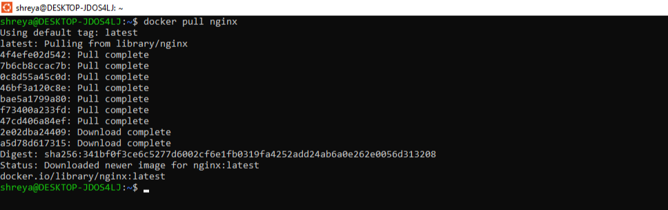
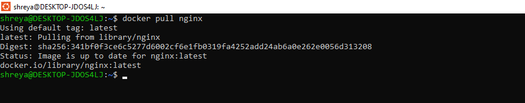
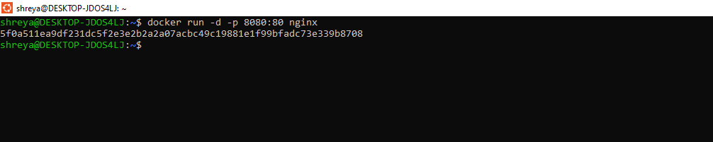
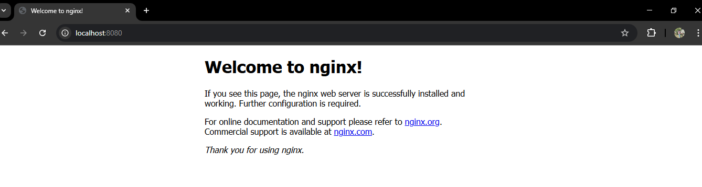
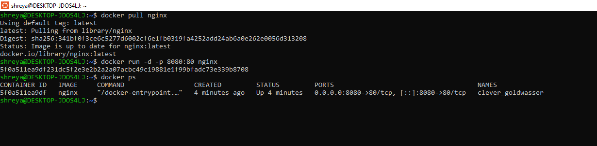

## Name: Shreya Mahara  
Roll no: R2142231007  
Sap-ID: 500121082  
School of Computer Science,

University of Petroleum and Energy Studies, Dehradun

## EXPERIMENT – 2
Docker Installation, Configuration, and Running Images

## Aim
To install and configure Docker, pull Docker images, run containers and manage
the container lifecycle using Docker commands.
## Objectives
 To pull Docker images from Docker Hub
 To run containers with port mapping
 To verify running containers
 To manage container lifecycle (start, stop, remove)

## Theory
Docker is an open-source containerization platform that allows applications to
be packaged along with their dependencies into lightweight, portable containers.
Containers run on a shared operating system kernel, making them faster and
more resource-efficient than traditional virtual machines.

A Docker Image is a read-only template used to create containers.
A Docker Container is a running instance of a Docker image.
Docker uses a client–server architecture, where the Docker client
communicates with the Docker daemon to build, run, and manage containers.

## Software Requirements
 Windows OS
 Docker Desktop with WSL integration
 Ubuntu (WSL distribution)

Procedure / Steps to Perform the Experiment

## Step 1: Pull Docker Image
The Nginx image is pulled from Docker Hub using the following command:
docker pull nginx
  

This command downloads the latest official Nginx image to the local system.

## Step 2: Run Container with Port Mapping
Run the Nginx container in detached mode with port mapping:
docker run -d -p 8080:80 nginx

## Explanation:
 -d → Runs container in background
 -p 8080:80 → Maps host port 8080 to container port 80
 nginx → Docker image name

## Step 3: Verify Running Containers
To check running containers, execute:
docker ps

This displays the container ID, image name, status, and port mapping.

Step 4: Stop and Remove Container
To stop the running container:
docker stop <container_id>

To remove the container:
docker rm <container_id>

Step 5: Remove Docker Image To remove the downloaded image:
docker rmi nginx

This frees disk space by deleting the unused image.

## Result
Docker images were successfully pulled, containers were executed, and container
lifecycle management commands were performed successfully.
## Conclusion
This experiment demonstrated the use of Docker for application deployment
using containers. Docker provides a lightweight, efficient, and portable environ
ment for running applications, making it suitable for modern DevOps and cloud-
native applications.

Viva-Voce Questions (Very Important)
- What is a Docker image?
- What is a Docker container?
- Difference between docker run and docker start?
- Purpose of port mapping in Docker?
- Why are containers lightweight compared to VMs?

## Overall Conclusion
This lab demonstrated virtualization using Vagrant + VirtualBox and
containerization using Docker, highlighting clear performance and resource
efficiency differences. Containers are better suited for rapid deployment and
microservices, while VMs provide stronger isolation.

