# **Experiment 4: Docker Essentials**

## Name: Shreya Mahara  
Roll no: R2142231007   
Sap-ID: 500121082    
School of Computer Science,

University of Petroleum and Energy Studies, Dehradun

## **Part 1: Containerizing Applications with Dockerfile**

### **Step 1: Create a Simple Application**

**Python Flask App:**
```bash
mkdir my-flask-app
cd my-flask-app
```
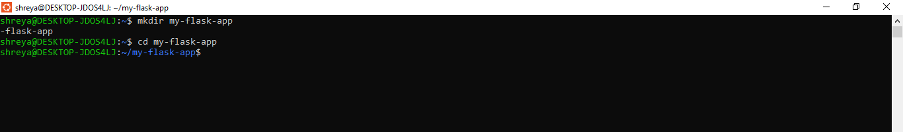

**`app.py`:**
```python
from flask import Flask
app = Flask(__name__)

@app.route('/')
def hello():
    return "Hello from Docker!"

@app.route('/health')
def health():
    return "OK"

if __name__ == '__main__':
    app.run(host='0.0.0.0', port=5000)
```
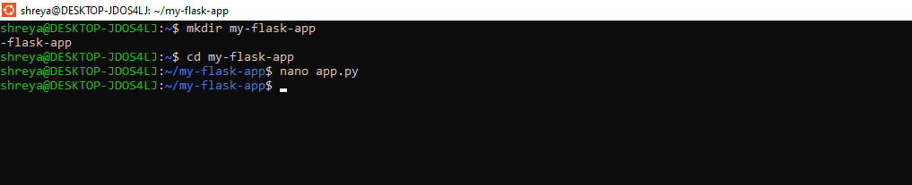
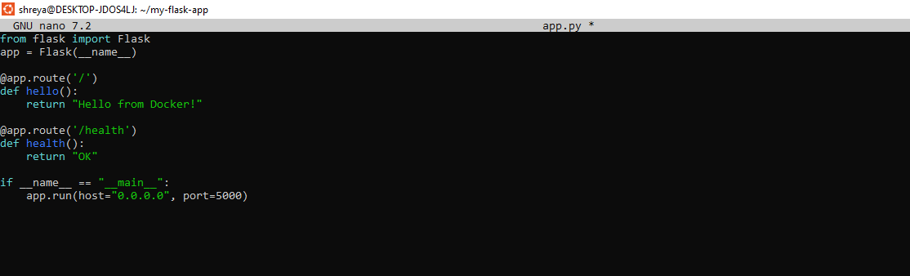

**`requirements.txt`:**
```
Flask==2.3.3
```

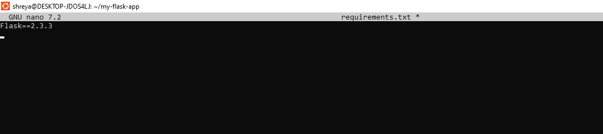

### **Step 2: Create Dockerfile**

**`Dockerfile`:**
```dockerfile
# Use Python base image
FROM python:3.9-slim

# Set working directory
WORKDIR /app

# Copy requirements file
COPY requirements.txt .

# Install dependencies
RUN pip install --no-cache-dir -r requirements.txt

# Copy application code
COPY app.py .

# Expose port
EXPOSE 5000

# Run the application
CMD ["python", "app.py"]
```
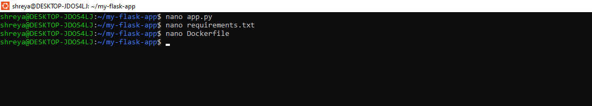

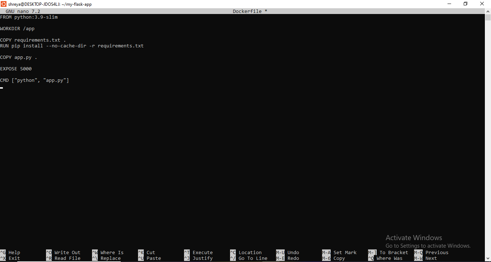

---

## **Part 2: Using .dockerignore**

### **Step 1: Create .dockerignore File**

**`.dockerignore`:**
```
# Python files
__pycache__/
*.pyc
*.pyo
*.pyd

# Environment files
.env
.venv
env/
venv/

# IDE files
.vscode/
.idea/

# Git files
.git/
.gitignore

# OS files
.DS_Store
Thumbs.db

# Logs
*.log
logs/

# Test files
tests/
test_*.py
```
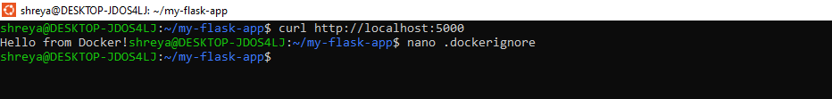
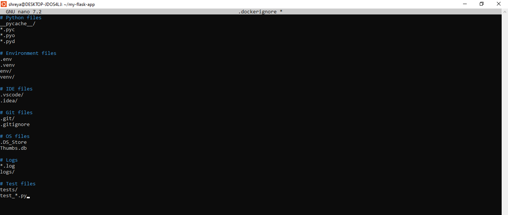


### **Step 2: Why .dockerignore is Important**
- Prevents unnecessary files from being copied
- Reduces image size
- Improves build speed
- Increases security

---

## **Part 3: Building Docker Images**

### **Step 1: Basic Build Command**
```bash
# Build image from Dockerfile
docker build -t my-flask-app .

# Check built images
docker images
```
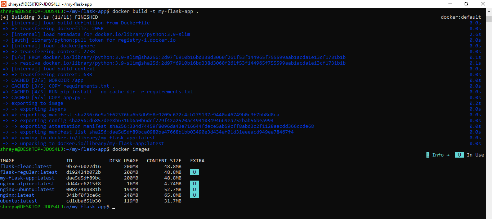

### **Step 2: Tagging Images**

```bash
# Tag with version number
docker build -t my-flask-app:1.0 .

# Tag with multiple tags
docker build -t my-flask-app:latest -t my-flask-app:1.0 .

# Tag with custom registry
docker build -t username/my-flask-app:1.0 .

# Tag existing image
docker tag my-flask-app:latest my-flask-app:v1.0
```
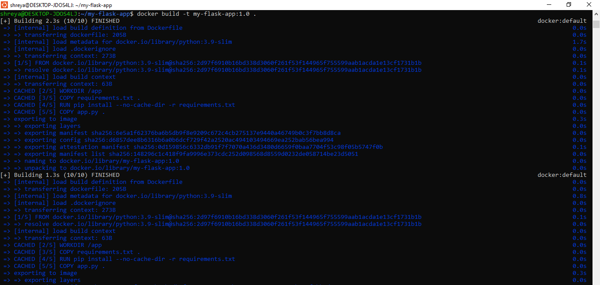  

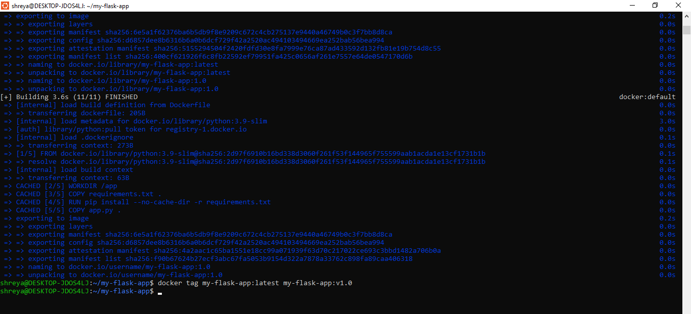

### **Step 3: View Image Details**
```bash
# List all images
docker images

# Show image history
docker history my-flask-app

# Inspect image details
docker inspect my-flask-app
```
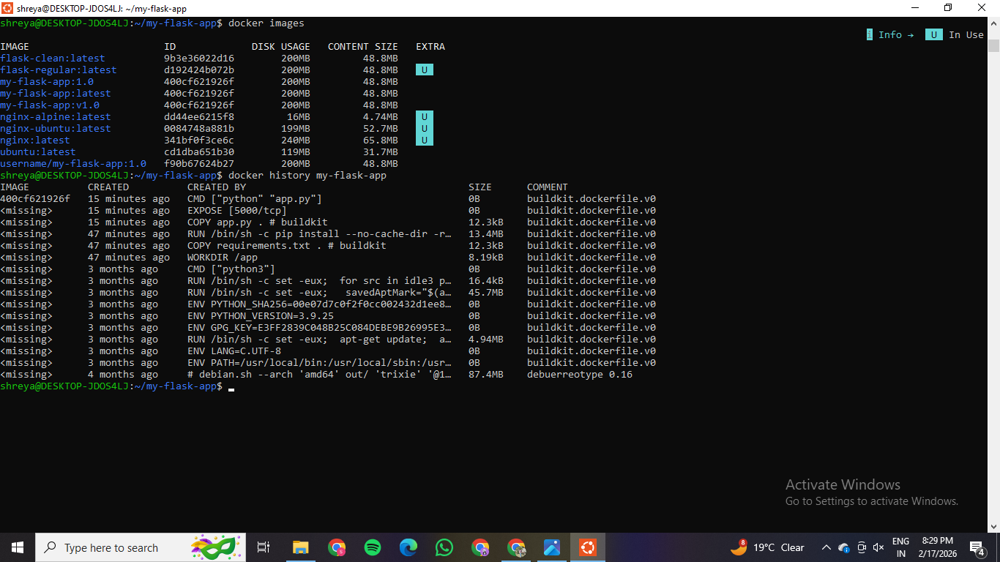  

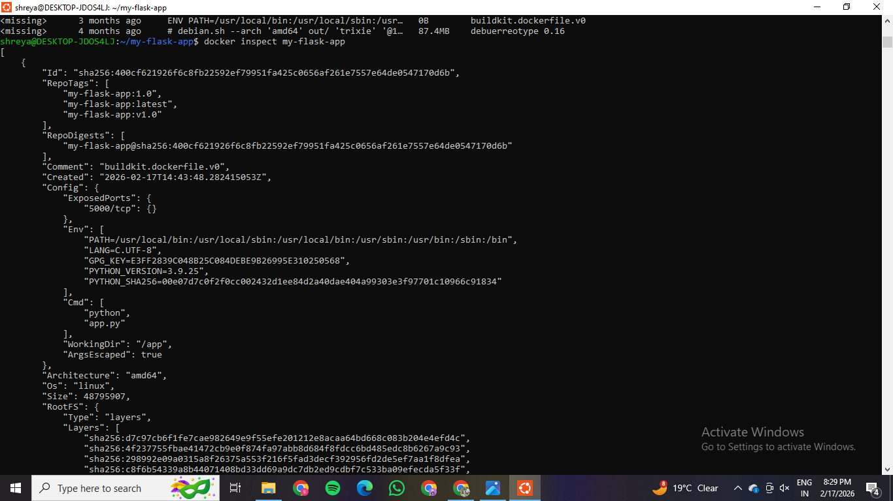 

---

## **Part 4: Running Containers**

### **Step 1: Run Container**
```bash
# Run container with port mapping
docker run -d -p 5000:5000 --name flask-container my-flask-app

# Test the application
curl http://localhost:5000

# View running containers
docker ps

# View container logs
docker logs flask-container
```
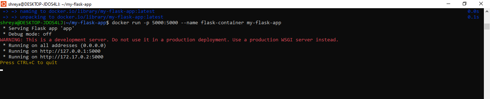

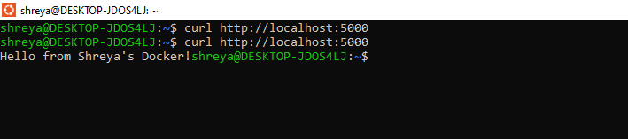

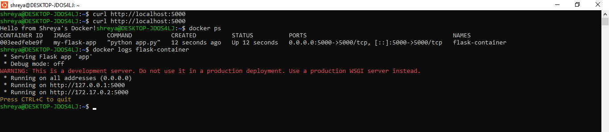

### **Step 2: Manage Containers**
```bash
# Stop container
docker stop flask-container

# Start stopped container
docker start flask-container

# Remove container
docker rm flask-container

# Remove container forcefully
docker rm -f flask-container
```
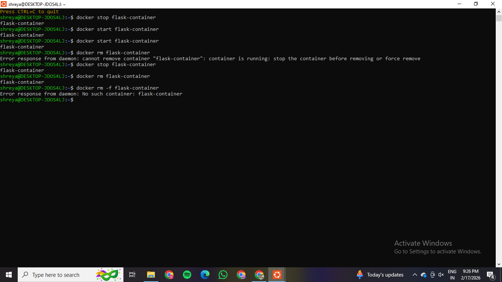

---

## **Part 5: Multi-stage Builds**

### **Step 1: Why Multi-stage Builds?**
- Smaller final image size
- Better security (remove build tools)
- Separate build and runtime environments

### **Step 2: Simple Multi-stage Dockerfile**

**`Dockerfile.multistage`:**
```dockerfile
# STAGE 1: Builder stage
FROM python:3.9-slim AS builder

WORKDIR /app

# Copy requirements
COPY requirements.txt .

# Install dependencies in virtual environment
RUN python -m venv /opt/venv
ENV PATH="/opt/venv/bin:$PATH"
RUN pip install --no-cache-dir -r requirements.txt

# STAGE 2: Runtime stage
FROM python:3.9-slim

WORKDIR /app

# Copy virtual environment from builder
COPY --from=builder /opt/venv /opt/venv
ENV PATH="/opt/venv/bin:$PATH"

# Copy application code
COPY app.py .

# Create non-root user
RUN useradd -m -u 1000 appuser
USER appuser

# Expose port
EXPOSE 5000

# Run application
CMD ["python", "app.py"]
```
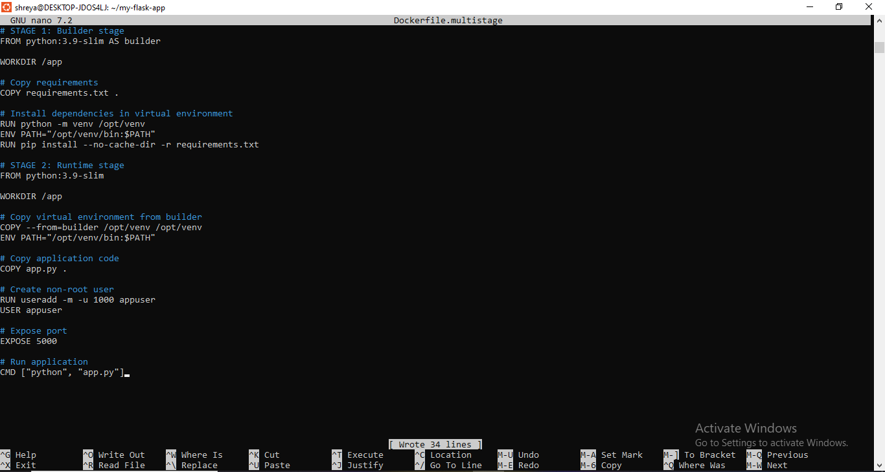

### **Step 3: Build and Compare**
```bash
# Build regular image
docker build -t flask-regular .

# Build multi-stage image
docker build -f Dockerfile.multistage -t flask-multistage .

# Compare sizes
docker images | grep flask-

# Expected output:
# flask-regular     ~250MB
# flask-multistage  ~150MB (40% smaller!)
```
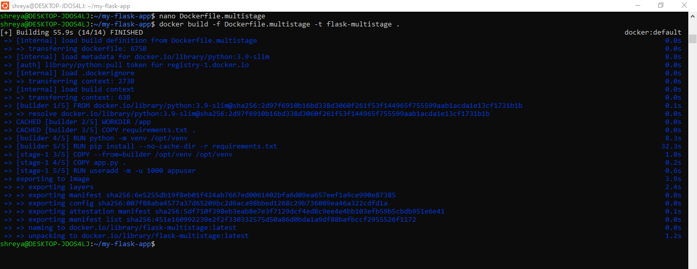


---

## **Part 6: Publishing to Docker Hub**

### **Step 1: Prepare for Publishing**
```bash
# Login to Docker Hub
docker login

# Tag image for Docker Hub
docker tag my-flask-app:latest username/my-flask-app:1.0
docker tag my-flask-app:latest username/my-flask-app:latest

# Push to Docker Hub
docker push username/my-flask-app:1.0
docker push username/my-flask-app:latest
```
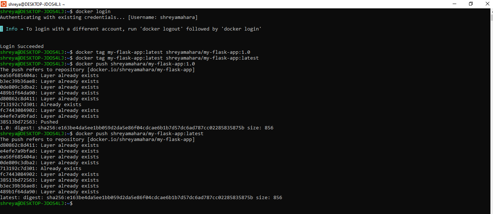
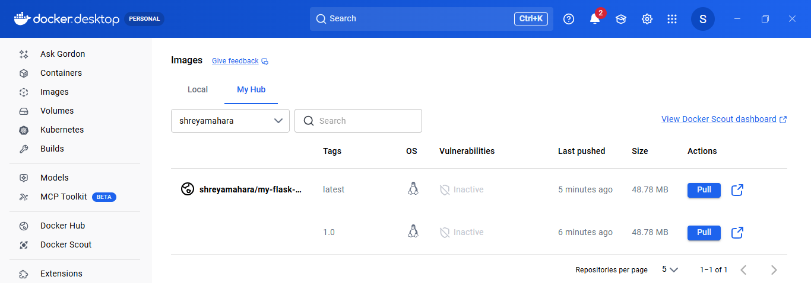

### **Step 2: Pull and Run from Docker Hub**
```bash
# Pull from Docker Hub (on another machine)
docker pull username/my-flask-app:latest

# Run the pulled image
docker run -d -p 5000:5000 username/my-flask-app:latest
```
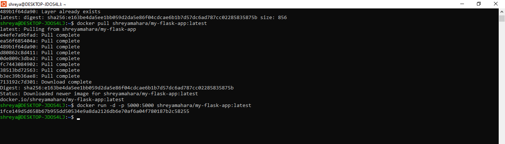

---

## **Part 7: Node.js Example (Quick Version)**

### **Step 1: Node.js Application**
```bash
mkdir my-node-app
cd my-node-app

```
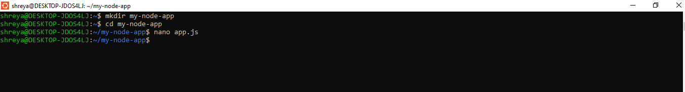
**`app.js`:**
```javascript
const express = require('express');
const app = express();
const port = 3000;

app.get('/', (req, res) => {
    res.send('Hello from Node.js Docker!');
});

app.get('/health', (req, res) => {
    res.json({ status: 'healthy' });
});

app.listen(port, () => {
    console.log(`Server running on port ${port}`);
});
```
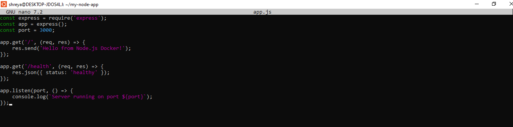

**`package.json`:**
```json
{
  "name": "node-docker-app",
  "version": "1.0.0",
  "main": "app.js",
  "dependencies": {
    "express": "^4.18.2"
  }
}
```
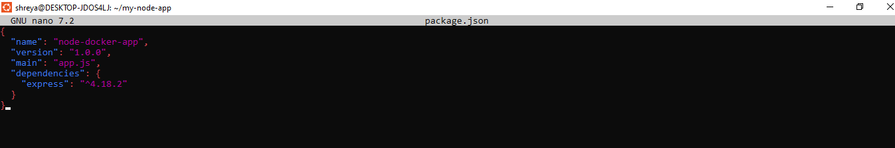
### **Step 2: Node.js Dockerfile**
```dockerfile
FROM node:18-alpine

WORKDIR /app

COPY package*.json ./
RUN npm install --only=production

COPY app.js .

EXPOSE 3000

CMD ["node", "app.js"]
```
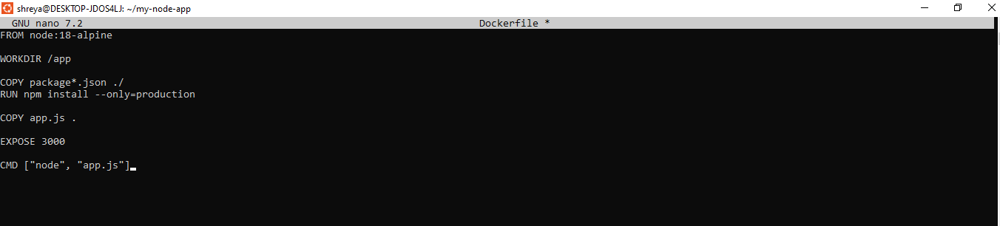


### **Step 3: Build and Run**
```bash
# Build image
docker build -t my-node-app .

# Run container
docker run -d -p 3000:3000 --name node-container my-node-app

# Test
curl http://localhost:3000
```

---

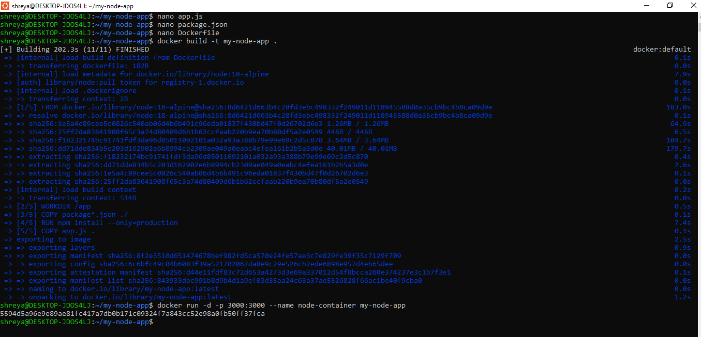
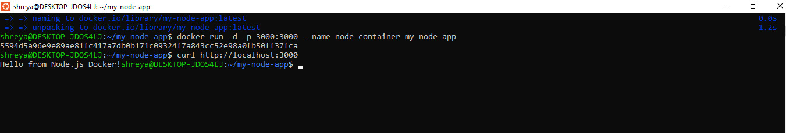

---

## **Essential Docker Commands Cheatsheet**

| Command | Purpose | Example |
|---------|---------|---------|
| `docker build` | Build image | `docker build -t myapp .` |
| `docker run` | Run container | `docker run -p 3000:3000 myapp` |
| `docker ps` | List containers | `docker ps -a` |
| `docker images` | List images | `docker images` |
| `docker tag` | Tag image | `docker tag myapp:latest myapp:v1` |
| `docker login` | Login to Dockerhub using username and password or token | `echo "token" | docker login -u username --password-stdin` |
| `docker push` | Push to registry | `docker push username/myapp` |
| `docker pull` | Pull from registry | `docker pull username/myapp` |
| `docker rm` | Remove container | `docker rm container-name` |
| `docker rmi` | Remove image | `docker rmi image-name` |
| `docker logs` | View logs | `docker logs container-name` |
| `docker exec` | Execute command | `docker exec -it container-name bash` |

---

## **Common Workflow Summary**

### **Development Workflow:**
```bash
# 1. Create Dockerfile and .dockerignore
# 2. Build image
docker build -t myapp .

# 3. Test locally
docker run -p 8080:8080 myapp

# 4. Tag for production
docker tag myapp:latest myapp:v1.0

# 5. Push to registry
docker push myapp:v1.0
```

### **Production Workflow:**
```bash
# 1. Pull from registry
docker pull myapp:v1.0

# 2. Run in production
docker run -d -p 80:8080 --name prod-app myapp:v1.0

# 3. Monitor
docker logs -f prod-app
```

---

## **Key Takeaways**

1. **Dockerfile** defines how to build your image
2. **.dockerignore** excludes unnecessary files (important for security and performance)
3. **Tagging** helps version and organize images
4. **Multi-stage builds** create smaller, more secure production images
5. **Docker Hub** allows sharing and distributing images
6. **Always test** images locally before publishing

---

## **Cleanup**
```bash
# Remove all stopped containers
docker container prune

# Remove unused images
docker image prune

# Remove everything unused
docker system prune -a
```
