# **Experiment 5: Docker - Volumes, Environment Variables, Monitoring and Networks**

## Name: Shreya Mahara  
Roll no: R2142231007   
Sap-ID: 500121082    
School of Computer Science,

University of Petroleum and Energy Studies, Dehradun

## **Part 1: Docker Volumes - Persistent Data Storage**

### **Lab 1: Understanding Data Persistence**

```bash

# Create a container that writes data
docker run -it --name test-container ubuntu /bin/bash

# Inside container:
echo "Hello World" > /data/message.txt
cat /data/message.txt  # Shows "Hello World"
exit

# Restart container
docker start test-container
docker exec test-container cat /data/message.txt
# ERROR: File doesn't exist! Data was lost.

```
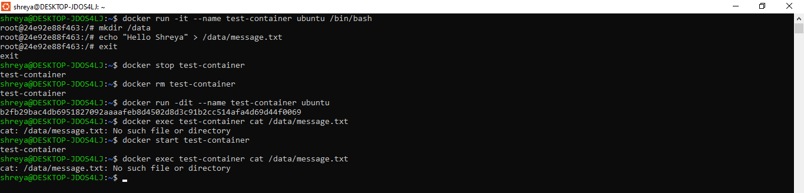
### **Lab 2: Volume Types**
**1. Anonymous Volumes:**
```bash

# Create anonymous volume (auto-generated name)
docker run -d -v /app/data --name web1 nginx

# Check volume
docker volume ls
# Shows: anonymous volume with random hash

# Inspect container to see volume mount
docker inspect web1 | grep -A 5 Mounts
```

**2. Named Volumes:**

```bash
# Create named volume
docker volume create mydata

# Use named volume
docker run -d -v mydata:/app/data --name web2 nginx

# List volumes
docker volume ls
# Shows: mydata

# Inspect volume
docker volume inspect mydata
```
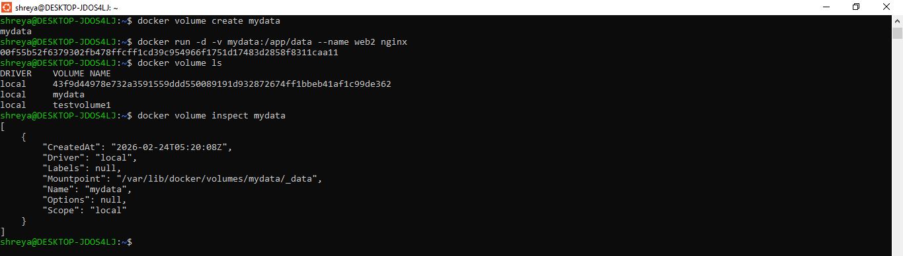

**3. Bind Mounts:**

```bash
# Create directory on host
mkdir ~/myapp-data

# Mount host directory to container
docker run -d -v ~/myapp-data:/app/data --name web3 nginx

# Add file on host
echo "From Host" > ~/myapp-data/host-file.txt

# Check in container
docker exec web3 cat /app/data/host-file.txt
# Shows: From Host
```
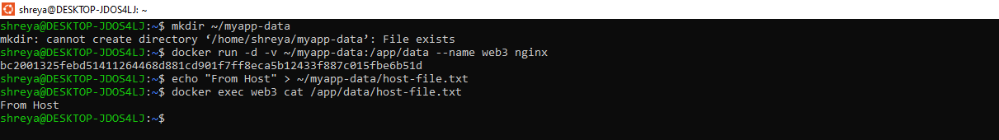

### **Lab 3: Practical Volume Examples**
**Example 1: Database with Persistent Storage**

```bash
# MySQL with named volume
docker run -d \
  --name mysql-db \
  -v mysql-data:/var/lib/mysql \
  -e MYSQL_ROOT_PASSWORD=secret \
  mysql:8.0

# Check data persists
docker stop mysql-db
docker rm mysql-db

# New container with same volume
docker run -d \
  --name new-mysql \
  -v mysql-data:/var/lib/mysql \
  -e MYSQL_ROOT_PASSWORD=secret \
  mysql:8.0
# Data is preserved!
```
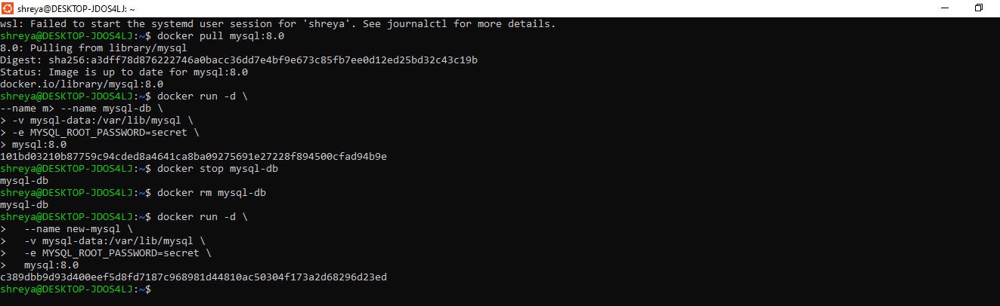

**Example 2:Web App with Configuration Files**

```bash
# Create config directory
mkdir ~/nginx-config

# Create nginx config file
echo 'server {
    listen 80;
    server_name localhost;
    location / {
        return 200 "Hello from mounted config!";
    }
}' > ~/nginx-config/nginx.conf

# Run nginx with config bind mount
docker run -d \
  --name nginx-custom \
  -p 8080:80 \
  -v ~/nginx-config/nginx.conf:/etc/nginx/conf.d/default.conf \
  nginx

# Test
curl http://localhost:8080
```
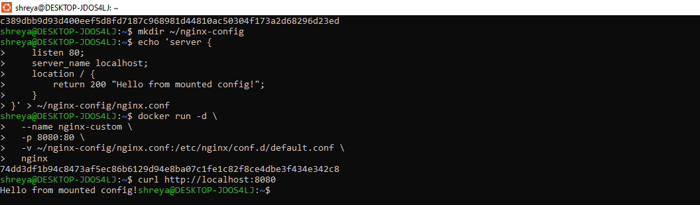 

### **Lab 4: Practical Volume Examples**

```bash
# List all volumes
docker volume ls

# Create a volume
docker volume create app-volume

# Inspect volume details
docker volume inspect app-volume

# Remove unused volumes
docker volume prune

# Remove specific volume
docker volume rm volume-name

# Copy files to/from volume
docker cp local-file.txt container-name:/path/in/volume
```
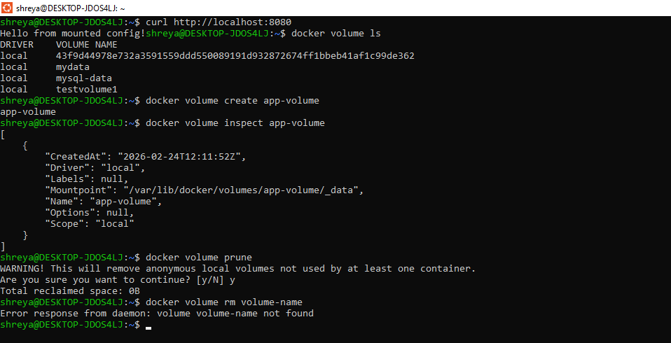
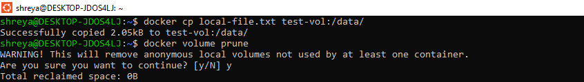

## **Part 2: Environment Variables**

### **Method 1: Using -e flag**

```bash
# Single variable
docker run -d \
  --name app1 \
  -e DATABASE_URL="postgres://user:pass@db:5432/mydb" \
  -e DEBUG="true" \
  -p 3000:3000 \
  my-node-app

# Multiple variables
docker run -d \
  -e VAR1=value1 \
  -e VAR2=value2 \
  -e VAR3=value3 \
  my-app
```
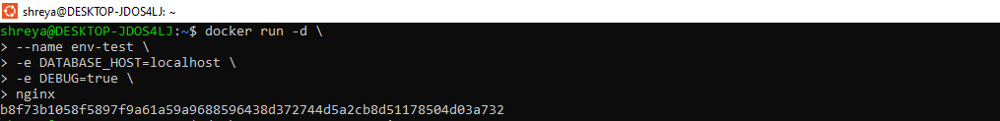

### **Method 2: Using --env-file**

```bash
# Create .env file
echo "DATABASE_HOST=localhost" > .env
echo "DATABASE_PORT=5432" >> .env
echo "API_KEY=secret123" >> .env

# Use env file
docker run -d \
  --env-file .env \
  --name app2 \
  my-app

# Use multiple env files
docker run -d \
  --env-file .env \
  --env-file .env.secrets \
  my-app
```


### **Method 3: In Dockerfile**

```bash
# Set default environment variables
ENV NODE_ENV=production
ENV PORT=3000
ENV APP_VERSION=1.0.0

# Can be overridden at runtime
```

### **Lab 2: Environment Variables in Application**
**Python Flask Example**

```bash
# app.py
import os
from flask import Flask

app = Flask(__name__)

# Read environment variables
db_host = os.environ.get('DATABASE_HOST', 'localhost')
debug_mode = os.environ.get('DEBUG', 'false').lower() == 'true'
api_key = os.environ.get('API_KEY')

@app.route('/config')
def config():
    return {
        'db_host': db_host,
        'debug': debug_mode,
        'has_api_key': bool(api_key)
    }

if __name__ == '__main__':
    port = int(os.environ.get('PORT', 5000))
    app.run(host='0.0.0.0', port=port, debug=debug_mode)
```
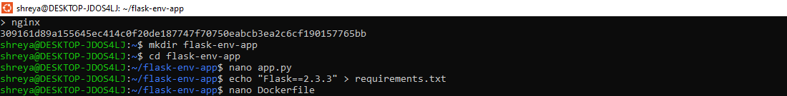
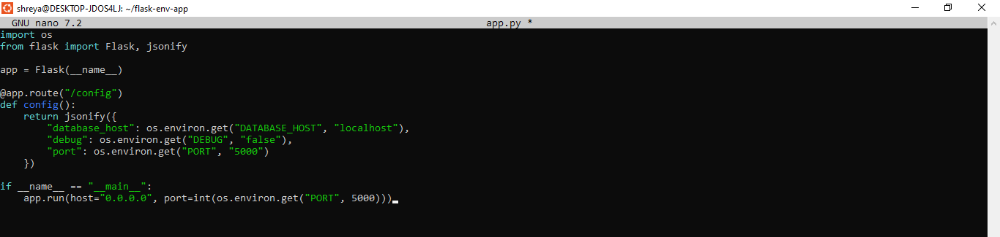

**Dockerfile with Environment Variables**

```bash
FROM python:3.9-slim

# Set environment variables at build time
ENV PYTHONUNBUFFERED=1
ENV PYTHONDONTWRITEBYTECODE=1

WORKDIR /app

COPY requirements.txt .
RUN pip install -r requirements.txt

COPY app.py .

# Default runtime environment variables
ENV PORT=5000
ENV DEBUG=false

EXPOSE 5000

CMD ["python", "app.py"]
```

### **Lab 3: Test Environment Variables**

```bash
# Run with custom env vars
docker run -d \
  --name flask-app \
  -p 5000:5000 \
  -e DATABASE_HOST="prod-db.example.com" \
  -e DEBUG="true" \
  -e PORT="8080" \
  flask-app

# Check environment in running container
docker exec flask-app env
docker exec flask-app printenv DATABASE_HOST

# Test the endpoint
curl http://localhost:5000/config
```
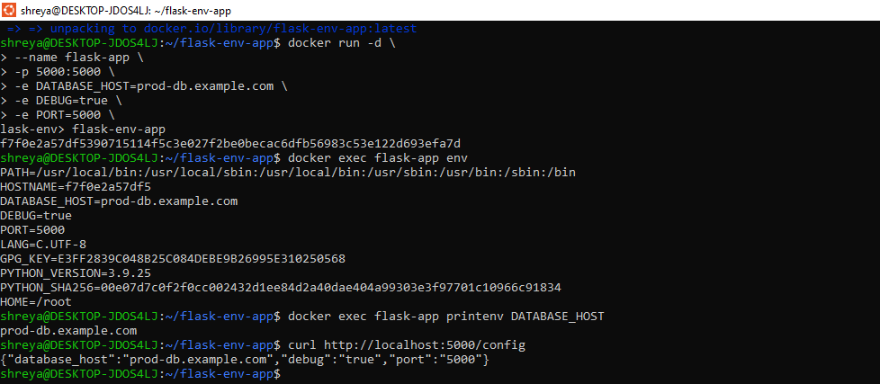

## **Part 3: Docker Monitoring**
### **Lab 1:Basic Monitoring Commands**
**docker stats- Real-Time Container Metrics**

```bash
# Live stats for all containers
docker stats

# Live stats for specific containers
docker stats container1 container2

# Specific format output
docker stats --format "table {{.Name}}\t{{.CPUPerc}}\t{{.MemUsage}}\t{{.NetIO}}"

# No-stream (single snapshot)
docker stats --no-stream

# All containers (including stopped)
docker stats --all

```
**Useful Format Options**
```bash
# Custom format
docker stats --format "Container: {{.Name}} | CPU: {{.CPUPerc}} | Memory: {{.MemPerc}}"

# JSON output
docker stats --format json --no-stream

# Wide output
docker stats --no-stream --no-trunc
```
